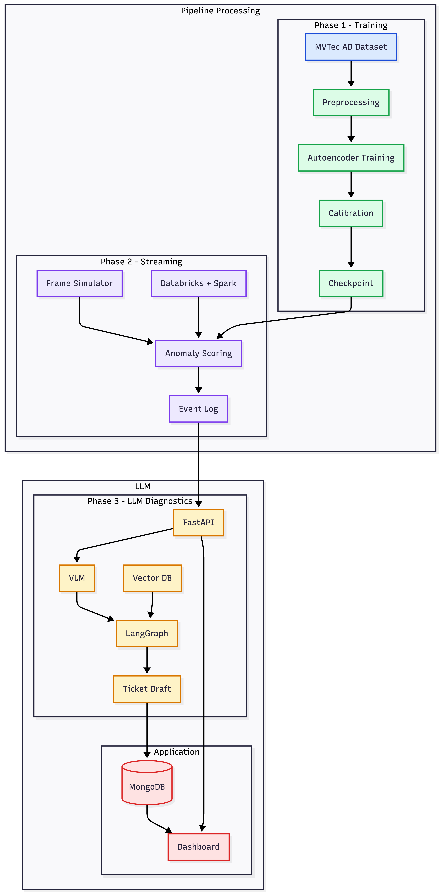

# Cold Start Streaming Defect Detector

An end-to-end manufacturing anomaly detection project for environments where defect samples are limited during new product introduction.

The system is built around an unsupervised **PyTorch autoencoder** that learns normal visual patterns from defect-free parts. Images or frames with high reconstruction error are treated as anomalies and can later be passed into an orchestration layer for diagnosis, SOP retrieval, and ticket generation.

## Overview

- Detect anomalies without needing a large labeled defect dataset
- Train an autoencoder on normal images from the MVTec AD dataset
- Score incoming images and flag abnormal frames using reconstruction error
- Run a local streaming simulation before integrating Databricks
- Extend the pipeline with FastAPI, LangGraph, FAISS, MongoDB, and a Next.js dashboard

---

## System Architecture



Architecture assets:

- `docs/Architecture-Diagram.png`
- `docs/architecture.js`
- `docs/architecture.md`

---

## Repository Structure

```text
.
├── apps/
│   ├── api/                # FastAPI backend
│   └── dashboard/          # Next.js frontend dashboard
├── data/
│   ├── processed/          # Processed artifacts
│   └── raw/                # Local datasets and streamed frames
├── docs/
│   ├── architecture.js     # Mermaid architecture source
│   └── architecture.md     # Architecture notes
├── ml/
│   ├── data/               # Dataset loading utilities
│   ├── inference/          # Frame scoring and thresholds
│   ├── models/             # Autoencoder models
│   └── training/           # Training entry points
├── orchestration/          # LLM, RAG, and ticket generation placeholders
├── streaming/
│   ├── databricks/         # Databricks jobs for later integration
│   └── simulator/          # Local frame simulation and scoring
├── .env.example
├── docker-compose.yml
└── README.md
```

---

## How It Works

1. Normal images from the MVTec AD dataset are used to train an autoencoder.
2. The model learns to reconstruct defect-free inputs with low error.
3. Reconstruction error is measured with mean squared error.
4. Images or frames above a chosen threshold are flagged as anomalies.
5. Local streaming simulates a live production feed for real-time scoring.
6. The backend, retrieval, and dashboard layers extend this into a full operational system.

---

## Setup

### Create and activate a virtual environment

```bash
python3 -m venv .venv
source .venv/bin/activate
```

### Install dependencies

```bash
pip install -r ml/requirements.txt
pip install -r streaming/requirements.txt
```

If Databricks dependencies are needed later:

```bash
pip install -r streaming/requirements.databricks.txt
```

### Environment variables

```bash
cp .env.example .env
```

---

## Dataset

Place the MVTec AD dataset under:

```text
data/raw/mvtec_ad/
```

Example structure:

```text
data/raw/mvtec_ad/bottle/
  train/good/
  test/good/
  test/broken_large/
  test/broken_small/
  ground_truth/
```

Everything inside `data/raw/` is ignored by Git.

---

## Run Locally

### Train a baseline model

```bash
python3 -m ml.training.train_autoencoder --category bottle
```

### Run local streaming inference

```bash
python3 -m streaming.simulator.local_stream_inference \
  --dataset-path data/raw/mvtec_ad/bottle/test \
  --checkpoint-path artifacts/models/bottle_autoencoder.pt \
  --fps 5
```

### Start the FastAPI backend

From `apps/api`:

```bash
pip install -r requirements.txt
uvicorn app.main:app --reload
```

### Start the dashboard

From `apps/dashboard`:

```bash
npm install
npm run dev
```

---

## Tech Stack

- **PyTorch** and **Torchvision**
- **MVTec AD dataset**
- **FastAPI**
- **Next.js**
- **MongoDB**
- **LangGraph**
- **FAISS**
- **Databricks** and **Spark Structured Streaming**

---

## Documentation

- `docs/architecture.md` contains the written architecture overview
- `docs/architecture.js` contains the reusable Mermaid diagram source

---

## Notes

- `data/raw/` is excluded from Git so datasets are not uploaded to GitHub.
- The current local workflow covers training and local streaming inference.
- Databricks integration can be added later using `streaming/databricks/`.

---
