# Architecture Overview

This document captures the high-level system design for the Cold Start Streaming Defect Detector.

The reusable Mermaid source for this diagram lives in `docs/architecture.js`.

## System Diagram

```mermaid
flowchart LR
    subgraph P1[Phase 1 - Training and Baseline Modeling]
        DS[MVTec AD Dataset]
        DL[Dataset Loader and Preprocessing]
        AE[PyTorch Autoencoder]
        TH[Threshold Calibration]
        CK[Checkpoint and Metrics]
        DS --> DL --> AE --> TH --> CK
    end

    subgraph P2[Phase 2 - Streaming Inference]
        SIM[Frame Simulator]
        DBX[Databricks / Spark Streaming]
        INF[Realtime Anomaly Scoring]
        EVT[Anomaly Event Log]
        SIM --> INF
        SIM -. future path .-> DBX --> INF
        INF --> EVT
    end

    subgraph P3[Phase 3 - LLM Diagnostics]
        API[FastAPI Backend]
        VLM[Vision Language Model]
        RAG[LangGraph + FAISS Retrieval]
        TKT[Maintenance Ticket Draft]
        EVT --> API --> VLM --> RAG --> TKT
    end

    subgraph P4[Phase 4 - Application Layer]
        MDB[(MongoDB)]
        UI[Next.js Dashboard]
        TKT --> MDB
        API --> UI
        MDB --> UI
    end

    CK -. model checkpoint .-> INF

    classDef dataset fill:#dbeafe,stroke:#1d4ed8,color:#1e3a8a;
    classDef ml fill:#dcfce7,stroke:#16a34a,color:#166534;
    classDef stream fill:#ede9fe,stroke:#7c3aed,color:#5b21b6;
    classDef orchestration fill:#fef3c7,stroke:#d97706,color:#92400e;
    classDef app fill:#fee2e2,stroke:#dc2626,color:#991b1b;

    class DS dataset;
    class DL,AE,TH,CK ml;
    class SIM,DBX,INF,EVT stream;
    class API,VLM,RAG,TKT orchestration;
    class MDB,UI app;
```

## Component Breakdown

### Phase 1 - Training and Baseline Modeling

- `ml/data/mvtec.py` loads MVTec AD categories and builds training/evaluation datasets.
- `ml/models/autoencoder.py` defines the convolutional autoencoder.
- `ml/training/train_autoencoder.py` trains the model, calibrates the anomaly threshold, and stores metrics.

### Phase 2 - Streaming Inference

- `streaming/simulator/producer.py` simulates a live image feed locally.
- `streaming/simulator/local_stream_inference.py` applies the trained model to a live-like frame stream.
- `streaming/databricks/structured_streaming_job.py` is reserved for the Databricks streaming path.

### Phase 3 - LLM Diagnostics

- `apps/api/` exposes anomaly and ticket-related APIs.
- `orchestration/graph.py` and `orchestration/agents.py` hold the retrieval and ticket-generation workflow.
- `orchestration/rag/` is reserved for FAISS indexing and query flow.

### Phase 4 - Application Layer

- `apps/dashboard/` contains the operational UI.
- `MongoDB` stores tickets, logs, and audit history.
- `FastAPI` acts as the bridge between anomaly events, diagnostics, and the dashboard.
